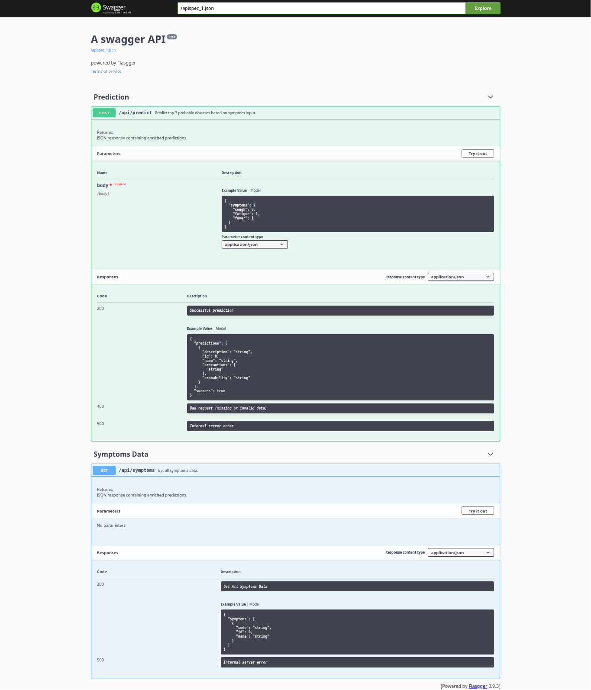
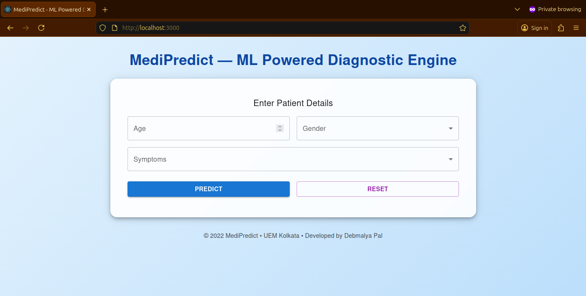
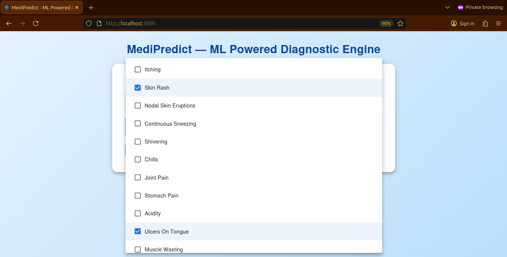
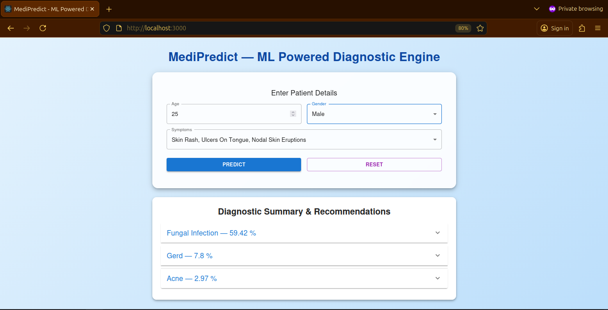
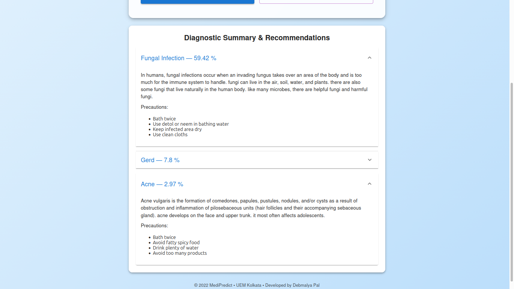

# 🩺 MediPredict – Disease Prediction System using Machine Learning

MediPredict is an end‑to‑end diagnostic assistant that predicts possible diseases based on user‑reported symptoms.  

It combines **Machine Learning**, a **Flask backend**, and a **React frontend** into a seamless, interactive medical prediction system.

---

## 🚨 Problem Statement

Early diagnosis of diseases is often difficult due to:  
- Lack of medical awareness  
- Misinterpretation of symptoms  
- Limited access to healthcare professionals  
- Delay in consulting doctors  

This challenge became especially visible during the late 2021 period, when the COVID‑19 pandemic had pushed global healthcare systems to their limits. During that time — which is when this project was originally developed — the general public faced unprecedented scarcity of medical resources, overwhelmed hospitals, and significant barriers to reaching qualified healthcare professionals. Even basic consultations became difficult, and many people were left to interpret their symptoms on their own.  
  
As a result, individuals increasingly turned to the internet for answers, often encountering misinformation, anxiety‑inducing content, and unreliable self‑diagnosis tools. This environment highlighted the urgent need for accessible, trustworthy, and structured symptom‑based guidance that could help people make informed decisions when professional help wasn’t immediately available.  

There is a need for a **reliable, ML‑powered system** that can:  
- Understand symptoms  
- Predict possible diseases  
- Provide detailed disease information  
- Assist users in making informed decisions  

---

## ✅ Solution Overview

**MediPredict** solves this by providing:  

- A **Machine Learning ensemble model** trained on symptom – disease datasets  
- A **Flask API backend** that handles prediction and symptom retrieval  
- A **React frontend** that offers a clean, interactive UI  
- A **Dockerized deployment** for easy replication and production use  

The system predicts the most probable disease and displays:  
- Description  
- Chances  
- Precautions
- Recommended Actions  

---

## 🧠 Approach & Methodology

### 1. **Dataset Preparation**
- Source: [Kaggle](https://www.kaggle.com/datasets/itachi9604/disease-symptom-description-dataset)
- Symptoms encoded as binary vectors  
- Diseases mapped to symptom combinations  
- Cleaned and normalized dataset  

### 2. **Model Training**
An ensemble of:  
- Naive Bayes  
- Random Forest  
- Decision Tree  

The ensemble improves accuracy and reduces model bias.  

### 3. **Backend (Flask)**
- Exposes `/api/symptoms` and `/api/predict` endpoints  
- Exposes /ready and /health endpoints for container orchestration and monitoring  
- Loads trained ML model  
- Returns predictions + disease metadata  
- CORS‑enabled for frontend communication  

### 4. **Frontend (React)**
- Multi‑step symptom selection  
- Prediction results with detailed disease info  
- Error handling & loading states  

### 5. **Deployment**
- Docker Compose for multi‑container setup  
- Nginx serving React build  
- Flask backend container  
- Internal networking for secure communication  

---

## 📁 Project Structure
```
MediPredict-Disease-Prediction-System-using-Machine-Learning/
│
├── Backend/
│   ├── app.py
│   ├── disease_ensemble.py
│   ├── logging_config.py
│   ├── custom_exceptions.py
│   ├── MLCode_Notebook.ipynb
│   ├── Model/
│   ├── Data/
│   ├── requirements.txt
│   ├── .gitignore
│   └── Dockerfile
│
├── Frontend/
│   ├── public/
│   ├── src/
│   ├── nginx.conf
│   ├── package.json
│   ├── package-lock.json
│   ├── .gitignore
│   ├── Dockerfile
│   └── README.md
│
├── docker-compose.yml
│
├── README-assets/
└── README.md
```

---

## 🏗️ System Architecture

### 🔹 Flask Backend
- Hosts ML model  
- Provides REST API  
- Handles prediction logic  
- Serves disease metadata  

### 🔹 ML Prediction Model
- Ensemble classifier  
- Trained on symptom – disease dataset  
- Outputs top 3 disease prediction  

### 🔹 React Frontend
- User selects symptoms  
- Sends request to backend  
- Displays prediction + details  

### 🔹 Dockerized Deployment
- Nginx → Serves React build  
- Flask → Runs backend API  
- Internal Docker network → No CORS issues  

---

### 🏗️ System Architecture Diagram

```
┌──────────────────────────┐
│        React UI          │
│  (User selects symptoms) │
└───────────┬──────────────┘
            │  HTTP Request
            ▼
┌──────────────────────────┐
│          Nginx           │
│   Serves React build     │
│  Proxies /api → Backend  │
└───────────┬──────────────┘
            │
            ▼
┌──────────────────────────┐
│      Flask Backend       │
│  /symptoms   /predict    │
└───────────┬──────────────┘
            │
            ▼
┌──────────────────────────┐
│    ML Ensemble Model     │
│  NB + RandomForest + DT  │
└──────────────────────────┘
```


### 🧠 ML Pipeline Diagram

```
User Symptoms ──> Symptom Dictionary Encoding ──> Input DataFrame Construction
                                                            │
                                                            ▼
Disease Prediction     <──────────────             Ensemble Classifier
                                        (Random Forest + Naive Bayes + Decision Tree)
      │
      ▼
Disease Metadata Lookup   ──────────>   Final JSON Response    
(Description, Precautions)
```


### 🐳 Docker Architecture Diagram

```
┌──────────────────────────────────────────────────────────────┐
│                        Docker Compose                        │
└──────────────────────────────────────────────────────────────┘
          │                                     │
          ▼                                     ▼
  ┌──────────────────────┐           ┌──────────────────────┐
  │   Frontend Container │           │   Backend Container  │
  │  (Nginx + React App) │           │   (Flask + ML Model) │
  └───────────┬──────────┘           └───────────┬──────────┘
              │    Internal Docker Network       |
              |           (medinet)              │
              └──────────────────────────────────┘
```


### 🔁 Sequence Diagram

```
User (Browser)
      │
      │ 1. Opens React App
      ▼
React Frontend
      │
      │ 2. GET /api/symptoms
      ▼
Nginx (Proxy)
      │
      │ 3. Forward to Flask /api/symptoms
      ▼
Flask Backend
      │
      │ 4. Returns symptoms list (JSON)
      ▼
React Frontend
      │
      │ 5. User selects symptoms
      ▼
React Frontend
      │
      │ 6. POST /api/predict { symptoms: [...] }
      ▼
Nginx (Proxy)
      │
      │ 7. Forward to Flask /api/predict
      ▼
Flask Backend
      │
      │ 8. ML Model Predicts Disease
      │
      │ 9. Fetch metadata from JSON files
      ▼
Flask Backend
      │
      │ 10. Return predictions (JSON)
      ▼
React Frontend
      │
      │ 11. Display results to user
      ▼
User (Browser)
```


### 📡 API Documentation

#### **1. GET `/api/symptoms`**
Returns the list of all symptoms in the system.

**Response Example:**
```json
{
    "symptoms": [
        {
            "id": 0,
            "name": "Skin Rash", 
            "code": "skin_rash",
        },  
        {
            "id": 1,  
            "name": "Itching",  
            "code": "itching",  
        },  
        ...  
    ]  
}
```


#### **2. POST `/api/predict`**
Predicts disease(s) based on symptoms.

**Request Body:**
```json
{  
    "symptoms": [  
        {"itching": 1},  
        {"skin_rash": 1},  
        {"fatigue": 1},  
        ...  
    ]  
}
```

**Response Example:**
```json
{
    "predictions": [
        {
            "id": 1,
            "disease": "Fungal infection",
            "description": "...",
            "precautions": ["keep infected area dry", "use antifungal powder"],
            "probability": "64.55%"
        },
        {
            "id": 5,
            "disease": "Allergy",
            "description": "...",
            "precautions": [],
            "probability": "12.25%"
        },
        {
            "id": 12,
            "disease": "Drug Reaction",
            "description": "...",
            "precautions": ["use antifungal powder"],
            "probability": "4.49%"
        }
    ]
}
```

### 📄 API Documentation Using Swagger  
  

---

## 🎨 Working Sample

### 🔹 Home Page  
  

### 🔹 Symptom Selection  
  

### 🔹 Prediction Result  
  
  

---

## 🛠️ Local Setup & Running

### System Requirements
1. **Python** v9.6.x 
2. **Node JS** v16.20.x

Verify using:
```bash
python --version    # v9.6.5
node --version      # v16.20.2
```

### [1] Clone the Repository
```bash
git clone git@github.com:DebmalyaPal/MediPredict-Disease-Prediction-System-using-Machine-Learning.git
cd MediPredict-Disease-Prediction-System-using-Machine-Learning
```


### [2A] ▶️ Running Locally

#### BACKEND
```bash
cd Backend
pip install -r requirements.txt
```

To create our ensemble prediction model and prepare JSON data for own backend - frontend system, we need to execute the contents of our notebook `MLcode_Notebook.ipynb`.  
We can do so by the following 2 ways:  
1. Open the notebook `MLCode_Notebook.ipynb` and manually run all the cells.
2. Convert the notebook to a python script and then run it as a python script.
```
pip install jupyter
jupyter nbconvert --to script MLcode_Notebook.ipynb --output notebook

mkdir -p Model/

python notebook.py
```

Now, we have our Model and JSON data ready to be used by the flask app. So, we can proceed with running the flask app.

```bash
mkdir -p Model/
python app.py
```

Backend (Flask app) runs at: `http://localhost:5000`  


#### Frontend
```bash
cd Frontend
npm install
npm start
```

Frontend runs at: `http://localhost:3000`  


### [2B] 🐳 Running with Docker Compose (Recommended)

#### 1️⃣ Build & Start Containers
```bash
docker compose up --build
```
> Earlier: docker-compose up --build

#### 2️⃣ Access the App
Frontend: `http://localhost:3000`  
Backend (internal): `http://medipredict-backend:5000`  
Backend (external): `http://localhost:5000`


---

## 🚀 Production Deployment Notes

- Nginx serves React build  
- API requests proxied to Flask backend  
- No CORS issues  
- Backend not exposed publicly  
- Fully containerized architecture  

---

## ⭐ Acknowledgements

- Dataset: [Kaggle](https://www.kaggle.com/datasets/itachi9604/disease-symptom-description-dataset) 
- ML models built using scikit‑learn  
- UI built with React  
- Backend powered by Flask  

